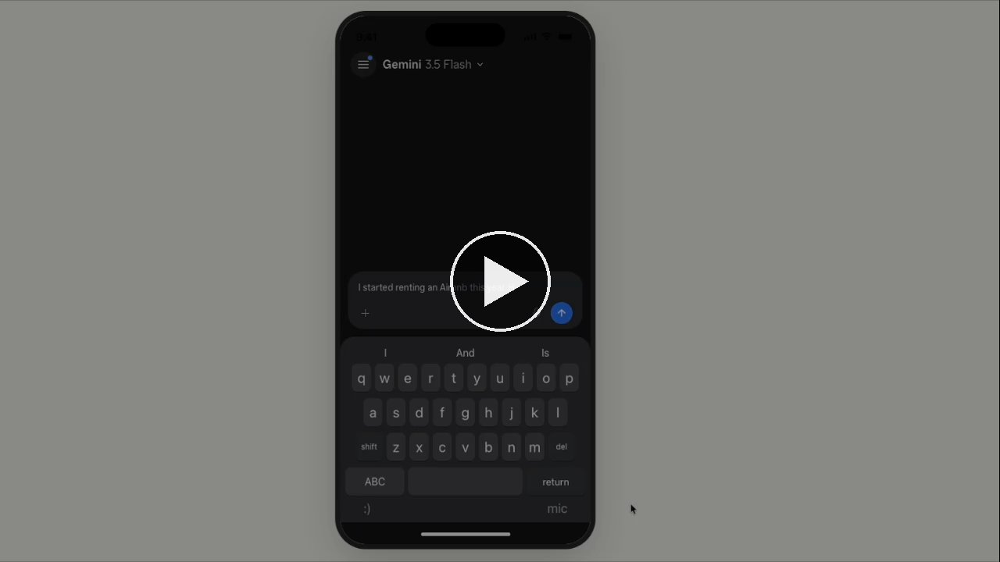

# FY27 DIWM Prototype

FY27 Assisted Vignettes — anchor flow showing a DIWM (Do It With Me) customer journey.

**Theme:** turbotax · **Brand:** turbotax · **Created:** 2026-05-18

## Try it live

- **Main DIWM journey:** https://xiaoseanlu.github.io/diwm-journey/#/diwm-journey/mweb
- **All flows (hub):** https://xiaoseanlu.github.io/diwm-journey/

On the first screen, choose **"Do it myself" → Get started** to continue through the built flow. (The "Hand off to a local expert" tile links out to an internal Figma prototype.)

## Demo video

[](https://xiaoseanlu.github.io/diwm-journey/demo/fs-version2-aiVO-final.mp4)

▶️ [Watch the full walkthrough with AI voiceover (9:40)](https://xiaoseanlu.github.io/diwm-journey/demo/fs-version2-aiVO-final.mp4)

## What's inside

- 7-screen DIWM customer journey: SKU Choice → Welcome → AI Chat → Expert Match → Review Hub → Plan Ahead → End
- ~19 supporting flows on the hub (post-call outcomes, expert review, mid-year check-in, and more)
- mWeb (393px) format with MWebShell · React + TypeScript with CGDS tokens

## Run locally

```bash
nvm use                    # Node 20
npm install --include=dev
npm run dev                # opens http://localhost:5174/#/diwm-journey/mweb
```

Deploy to GitHub Pages with `npm run deploy:pages`.

> Note: `cds-react-components` installs via SSH from github.intuit.com, so install/build requires Intuit GHE access.

## Source

Figma: [FY27 Assisted Vignettes Round 2](https://www.figma.com/design/fY7UyUzTMfHQGze2Jbg7oo/FY27-Assisted-Vignettes-Round-2?node-id=1646-18964)
